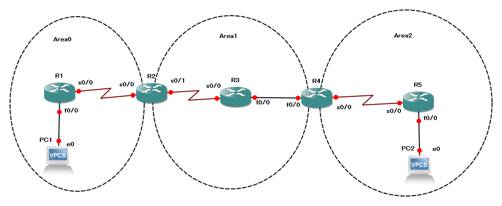

OSPF
=============================

Open Shortest Path First

.. toctree::
   :maxdepth: 1
   :caption: Contents:

.. contents:: TOC

===========================
Foundation
===========================

OSPF ルータ間の関係
---------------------------------------------

ネイバー（Neighbor）
  同じセグメント上の OSPF ルータ同士の関係
隣接（アジャセンシー, adjacency）
  実際に LSA 交換して LSDB の同期を図る関係
DR
  Designated Router
BDR
  Backup Designated Router
DROTHER
  DR/BDR 以外のルーター

ネイバー関係の数::

  n(n-1)/2

DR/BDR の選出
---------------------------------------------

#. OSPFプライオリティ
#. DR プライオリティが最大
#. BDR プライオリティが2番目に大きい
#. 0 にすると DROTHER
#. プライオリティが同じならルータIDが最大のルーターがDR、同様に2番目に大きいルーターがBDR
#. DR/BDR はマルチアクセスネットワークのセグメント（サブネット）ごとに選出される

DR/BDR の選出は OSPF プロセスの起動したタイミングでおこなわれる
ゆえに DR として稼働させたいルーターから順番に起動する

マルチキャスト
----------------------------------------

224.0.0.5
  すべての OSPF ルータ宛
224.0.0.6
  DR/BDR 宛

Hello パケット
------------------------------

* ルータID
* ネットワークマスク
* Hello/Dead インターバル
* ネイバーリスト
* エリアID
* OSPFプライオリティ
* DR/BDR IP アドレス
* 認証パスワード
* スタブエリアフラグ

初期状態遷移
------------------------------

#. DOWN
#. INIT
#. 2WAY
#. DR/BDR 選出
#. EXSTART
#. EXCHANGE
#. LOADING
#. FULL

p.125

OSPF の設定で誤っているもの

誤::

   ip ospf area <area-id>

正::

   ip ospf <process-id> area <area-id>

OSPF プロセス ID を指定する必要がある。

::

   R1>en
   R1#rout
   R1#route
   R1#conf t
   Enter configuration commands, one per line.  End with CNTL/Z.
   R1(config)#int f0/0
   R1(config-if)#ip addr
   R1(config-if)#ip addr 10.1.1.1 255.255.255.0
   R1(config-if)#no shut
   R1(config-if)#int
   *Feb 16 12:30:06.063: %LINK-3-UPDOWN: Interface FastEthernet0/0, changed state to up
   *Feb 16 12:30:07.063: %LINEPROTO-5-UPDOWN: Line protocol on Interface FastEthernet0/0, changed state to up
   R1(config-if)#int s0/0/0
   R1(config-if)#ip addr
   R1(config-if)#ip address 10.2.2.1 255.355.255.252
                                           ^
   % Invalid input detected at '^' marker.
   
   R1(config-if)#ip address 10.2.2.1 255.255.255.252
   R1(config-if)#no shut
   R1(config-if)#
   *Feb 16 12:31:05.191: %LINK-3-UPDOWN: Interface Serial0/0/0, changed state to down
   R1(config-if)#do sh int s0/0/0
   Serial0/0/0 is down, line protocol is down
     Hardware is GT96K Serial
     Internet address is 10.2.2.1/30
     MTU 1500 bytes, BW 1544 Kbit/sec, DLY 20000 usec,
        reliability 255/255, txload 1/255, rxload 1/255
     Encapsulation HDLC, loopback not set
     Keepalive set (10 sec)
     CRC checking enabled
     Last input never, output never, output hang never
     Last clearing of "show interface" counters never
     Input queue: 0/75/0/0 (size/max/drops/flushes); Total output drops: 0
     Queueing strategy: weighted fair
     Output queue: 0/1000/64/0 (size/max total/threshold/drops)
        Conversations  0/0/256 (active/max active/max total)
        Reserved Conversations 0/0 (allocated/max allocated)
        Available Bandwidth 1158 kilobits/sec
     5 minute input rate 0 bits/sec, 0 packets/sec
     5 minute output rate 0 bits/sec, 0 packets/sec
        0 packets input, 0 bytes, 0 no buffer
        Received 0 broadcasts (0 IP multicasts)
        0 runts, 0 giants, 0 throttles
        0 input errors, 0 CRC, 0 frame, 0 overrun, 0 ignored, 0 abort
        0 packets output, 0 bytes, 0 underruns
   
   R1(config-if)#do sh run int s0/0/0
   Building configuration...
   
   Current configuration : 66 bytes
   !
   interface Serial0/0/0
    ip address 10.2.2.1 255.255.255.252
   end
   
   R1(config-if)#do sh run int fa0/1
   Building configuration...
   
   Current configuration : 83 bytes
   !
   interface FastEthernet0/1
    no ip address
    shutdown
    duplex auto
    speed auto
   end
   
   R1(config-if)#
   *Feb 16 12:33:10.679: %LINK-3-UPDOWN: Interface Serial0/0/0, changed state to up
   *Feb 16 12:33:11.679: %LINEPROTO-5-UPDOWN: Line protocol on Interface Serial0/0/0, changed state to up
   R1(config-if)#do sh ip int bri
   Interface                  IP-Address      OK? Method Status                Protocol
   FastEthernet0/0            10.1.1.1        YES manual up                    up
   FastEthernet0/1            unassigned      YES NVRAM  administratively down down
   Serial0/0/0                10.2.2.1        YES manual up                    up
   R1(config-if)#do sh ip route
   Codes: L - local, C - connected, S - static, R - RIP, M - mobile, B - BGP
          D - EIGRP, EX - EIGRP external, O - OSPF, IA - OSPF inter area
          N1 - OSPF NSSA external type 1, N2 - OSPF NSSA external type 2
          E1 - OSPF external type 1, E2 - OSPF external type 2
          i - IS-IS, su - IS-IS summary, L1 - IS-IS level-1, L2 - IS-IS level-2
          ia - IS-IS inter area, * - candidate default, U - per-user static route
          o - ODR, P - periodic downloaded static route, H - NHRP, l - LISP
          + - replicated route, % - next hop override
   
   Gateway of last resort is not set
   
         10.0.0.0/8 is variably subnetted, 4 subnets, 3 masks
   C        10.1.1.0/24 is directly connected, FastEthernet0/0
   L        10.1.1.1/32 is directly connected, FastEthernet0/0
   C        10.2.2.0/30 is directly connected, Serial0/0/0
   L        10.2.2.1/32 is directly connected, Serial0/0/0
   R1(config-if)#do sh ip route ?
   % Ambiguous command:  "do sh ip route "
   R1(config-if)#do sh ip route conne
   % Ambiguous command:  "do sh ip route conne"
   R1(config-if)#do sh ip route connected
   Codes: L - local, C - connected, S - static, R - RIP, M - mobile, B - BGP
          D - EIGRP, EX - EIGRP external, O - OSPF, IA - OSPF inter area
          N1 - OSPF NSSA external type 1, N2 - OSPF NSSA external type 2
          E1 - OSPF external type 1, E2 - OSPF external type 2
          i - IS-IS, su - IS-IS summary, L1 - IS-IS level-1, L2 - IS-IS level-2
          ia - IS-IS inter area, * - candidate default, U - per-user static route
          o - ODR, P - periodic downloaded static route, H - NHRP, l - LISP
          + - replicated route, % - next hop override
   
   Gateway of last resort is not set
   
         10.0.0.0/8 is variably subnetted, 4 subnets, 3 masks
   C        10.1.1.0/24 is directly connected, FastEthernet0/0
   L        10.1.1.1/32 is directly connected, FastEthernet0/0
   C        10.2.2.0/30 is directly connected, Serial0/0/0
   L        10.2.2.1/32 is directly connected, Serial0/0/0
   R1(config-if)#do sh ip route local
   Translating "local"...domain server (255.255.255.255)
   
   sh ip route local
                 ^
   % Invalid input detected at '^' marker.
   
   R1(config-if)#
   R1#
   R1#
   R1#
   R1#
   R1#
   R1#9~
   *Feb 16 12:37:30.535: %SYS-5-CONFIG_I: Configured from console by console
   R1#conf t
   Enter configuration commands, one per line.  End with CNTL/Z.
   R1(config)#router
   R1(config)#router os
   R1(config)#router ospf 1
   R1(config-router)#netwo
   R1(config-router)#network 10.1.1.0 0.0.0.255 are
   R1(config-router)#network 10.1.1.0 0.0.0.255 area 0
   R1(config-router)#netwo
   R1(config-router)#network 10.2.2.0 0.0.0.3 area 0
   R1(config-router)#^Z
   R1#
   *Feb 16 12:40:07.707: %SYS-5-CONFIG_I: Configured from console by console
   R1#
   *Feb 16 12:41:38.767: %OSPF-5-ADJCHG: Process 1, Nbr 10.3.3.2 on Serial0/0/0 from LOADING to FULL, Loading Done

::

   R2>en
   R2#conf t
   Enter configuration commands, one per line.  End with CNTL/Z.
   R2(config)#int s0/0/0
   R2(config-if)#ip addr 10.2.2.3 255.255.255.252
   Bad mask /30 for address 10.2.2.3
   R2(config-if)#ip addr 10.2.2.2 255.255.255.252
   R2(config-if)#no shut
   R2(config-if)#
   *Feb 16 13:34:29.587: %LINK-3-UPDOWN: Interface Serial0/0/0, changed state to up
   *Feb 16 13:34:30.587: %LINEPROTO-5-UPDOWN: Line protocol on Interface Serial0/0/0, changed state to up
   R2(config-if)#int f0/0
   R2(config-if)#ip addr 10.3.3.2 255.255.255.0
   R2(config-if)#no shut
   R2(config-if)#
   *Feb 16 13:35:30.307: %LINK-3-UPDOWN: Interface FastEthernet0/0, changed state to up
   *Feb 16 13:35:31.307: %LINEPROTO-5-UPDOWN: Line protocol on Interface FastEthernet0/0, changed state to up
   R2(config-if)#
   *Feb 16 13:35:34.211: %LINEPROTO-5-UPDOWN: Line protocol on Interface FastEthernet0/0, changed state to down
   R2(config-if)#do sh int fa0/0
   FastEthernet0/0 is up, line protocol is down
     Hardware is Gt96k FE, address is 0024.c431.126e (bia 0024.c431.126e)
     Internet address is 10.3.3.2/24
     MTU 1500 bytes, BW 100000 Kbit/sec, DLY 100 usec,
        reliability 255/255, txload 1/255, rxload 1/255
     Encapsulation ARPA, loopback not set
     Keepalive set (10 sec)
     Auto-duplex, Auto Speed, 100BaseTX/FX
     ARP type: ARPA, ARP Timeout 04:00:00
     Last input never, output never, output hang never
     Last clearing of "show interface" counters never
     Input queue: 0/75/0/0 (size/max/drops/flushes); Total output drops: 0
     Queueing strategy: fifo
     Output queue: 0/40 (size/max)
     5 minute input rate 0 bits/sec, 0 packets/sec
     5 minute output rate 0 bits/sec, 0 packets/sec
        0 packets input, 0 bytes
        Received 0 broadcasts (0 IP multicasts)
        0 runts, 0 giants, 0 throttles
        0 input errors, 0 CRC, 0 frame, 0 overrun, 0 ignored
        0 watchdog
        0 input packets with dribble condition detected
   
   R2(config-if)#
   *Feb 16 13:36:42.195: %LINEPROTO-5-UPDOWN: Line protocol on Interface FastEthernet0/0, changed state to up
   R2(config-if)#do sh ip int bri
   Interface                  IP-Address      OK? Method Status                Protocol
   FastEthernet0/0            10.3.3.2        YES manual up                    up
   FastEthernet0/1            unassigned      YES NVRAM  administratively down down
   Serial0/0/0                10.2.2.2        YES manual up                    up
   R2(config-if)#do sh ip route
   Codes: L - local, C - connected, S - static, R - RIP, M - mobile, B - BGP
          D - EIGRP, EX - EIGRP external, O - OSPF, IA - OSPF inter area
          N1 - OSPF NSSA external type 1, N2 - OSPF NSSA external type 2
          E1 - OSPF external type 1, E2 - OSPF external type 2
          i - IS-IS, su - IS-IS summary, L1 - IS-IS level-1, L2 - IS-IS level-2
          ia - IS-IS inter area, * - candidate default, U - per-user static route
          o - ODR, P - periodic downloaded static route, H - NHRP, l - LISP
          + - replicated route, % - next hop override
   
   Gateway of last resort is not set
   
         10.0.0.0/8 is variably subnetted, 4 subnets, 3 masks
   C        10.2.2.0/30 is directly connected, Serial0/0/0
   L        10.2.2.2/32 is directly connected, Serial0/0/0
   C        10.3.3.0/24 is directly connected, FastEthernet0/0
   L        10.3.3.2/32 is directly connected, FastEthernet0/0
   R2(config-if)#router
   R2(config-if)#route
   R2(config-if)#exit
   R2(config)#router
   R2(config)#router os
   R2(config)#router ospf 1
   R2(config-router)#netwo
   R2(config-router)#network 10.0.0.0 0.255.255.255 area 0
   R2(config-router)#
   *Feb 16 13:42:57.687: %OSPF-5-ADJCHG: Process 1, Nbr 10.2.2.1 on Serial0/0/0 from LOADING to FULL, Loading Done
   R2(config-router)#int f0/0
   R2(config-if)#ip ospf
   R2(config-if)#ip ospf are
   R2(config-if)#ip ospf area
   R2(config-if)#ip ospf area 1
                          ^
   % Invalid input detected at '^' marker.
   
   R2(config-if)#ip os
   R2(config-if)#ip ospf are
   R2(config-if)#ip ospf area
   R2(config-if)#ip ospf area
   R2(config-if)#ip ospf area
   R2(config-if)#ip ospf area
   R2(config-if)#ip ospf area ?
   % Unrecognized command
   R2(config-if)#ip ospf
   R2(config-if)#ip ospf ?
     <1-65535>            Process ID
     authentication       Enable authentication
     authentication-key   Authentication password (key)
     bfd                  Enable BFD on this interface
     cost                 Interface cost
     database-filter      Filter OSPF LSA during synchronization and flooding
     dead-interval        Interval after which a neighbor is declared dead
     demand-circuit       OSPF Demand Circuit
     flood-reduction      OSPF Flood Reduction
     hello-interval       Time between HELLO packets
     lls                  Link-local Signaling (LLS) support
     message-digest-key   Message digest authentication password (key)
     mtu-ignore           Ignores the MTU in DBD packets
     network              Network type
     prefix-suppression   OSPF prefix suppression
     priority             Router priority
     resync-timeout       Interval after which adjacency is reset if oob-resync is
                          not started
     retransmit-interval  Time between retransmitting lost link state
                          advertisements
     shutdown             Set OSPF protocol's state to disable under current
                          interface
   
   R2(config-if)#ip ospf are
   R2(config-if)#ip ospf ?
     <1-65535>            Process ID
     authentication       Enable authentication
     authentication-key   Authentication password (key)
     bfd                  Enable BFD on this interface
     cost                 Interface cost
     database-filter      Filter OSPF LSA during synchronization and flooding
     dead-interval        Interval after which a neighbor is declared dead
     demand-circuit       OSPF Demand Circuit
     flood-reduction      OSPF Flood Reduction
     hello-interval       Time between HELLO packets
     lls                  Link-local Signaling (LLS) support
     message-digest-key   Message digest authentication password (key)
     mtu-ignore           Ignores the MTU in DBD packets
     network              Network type
     prefix-suppression   OSPF prefix suppression
     priority             Router priority
     resync-timeout       Interval after which adjacency is reset if oob-resync is
                          not started
     retransmit-interval  Time between retransmitting lost link state
                          advertisements
     shutdown             Set OSPF protocol's state to disable under current
                          interface
     transmit-delay       Link state transmit delay
     ttl-security         TTL security check
   
   R2(config-if)#ip ospf area 1
                          ^
   % Invalid input detected at '^' marker.
   
   R2(config-if)#are
   R2(config-if)#ip ?
   Interface IP configuration subcommands:
     access-group        Specify access control for packets
     accounting          Enable IP accounting on this interface
     address             Set the IP address of an interface
     admission           Apply Network Admission Control
     auth-proxy          Apply authentication proxy
     authentication      authentication subcommands
     bandwidth-percent   Set EIGRP bandwidth limit
     bgp                 BGP interface commands
     broadcast-address   Set the broadcast address of an interface
     cef                 Cisco Express Forwarding interface commands
     cgmp                Enable/disable CGMP
     dampening-change    Percent interface metric must change to cause update
     dampening-interval  Time in seconds to check interface metrics
     ddns                Configure dynamic DNS
     dhcp                Configure DHCP parameters for this interface
     directed-broadcast  Enable forwarding of directed broadcasts
     dns                 Configure DNS server
     flow                NetFlow related commands
     hello-interval      Configures EIGRP-IPv4 hello interval
     helper-address      Specify a destination address for UDP broadcasts
     hold-time           Configures EIGRP-IPv4 hold time
     idle-group          Specify interesting packets for idle-timer
     igmp                IGMP interface commands
     information-reply   Enable sending ICMP Information Reply messages
     inspect             Apply inspect name
     ips                 Create IPS rule
     irdp                ICMP Router Discovery Protocol
     lisp                Locator/ID Separation Protocol
     load-sharing        Style of load sharing
     local-proxy-arp     Enable local-proxy ARP
     mask-reply          Enable sending ICMP Mask Reply messages
     mfib                Interface Specific MFIB Control
     mobile              Mobile IP support
     mrm                 Configure IP Multicast Routing Monitor tester
     mroute-cache        Enable switching cache for incoming multicast packets
     mtu                 Set IP Maximum Transmission Unit
     multicast           IP multicast interface commands
     nat                 NAT interface commands
     nbar                Network-Based Application Recognition
     next-hop-self       Configures EIGRP-IPv4 next-hop-self
     ospf                OSPF interface commands
     pgm                 PGM Reliable Transport Protocol
     pim                 PIM interface commands
     policy              Enable policy routing
     proxy-arp           Enable proxy ARP
     proxy-mobile        Enable Proxy Mobile IP services
     rarp-server         Enable RARP server for static arp entries
     rbscp               RBSCP subfeatures for this interface
     redirects           Enable sending ICMP Redirect messages
     rgmp                Enable/disable RGMP
     rip                 Router Information Protocol
     route-cache         Enable fast-switching cache for outgoing packets
     router              IP router interface commands
     rsvp                RSVP Interface Commands
     sap                 Session Advertisement Protocol interface commands
     security            DDN IP Security Option
     service             IP service
     split-horizon       Perform split horizon
     summary-address     Perform address summarization
     tcp                 TCP header compression and other parameters
     traffic-export      Configure this interface for exporting ip traffic
     unnumbered          Enable IP processing without an explicit address
     unreachables        Enable sending ICMP Unreachable messages
     urd                 Configure URL Rendezvousing
     verify              Enable per packet validation
     virtual-reassembly  Enable Virtual Fragment Reassembly
     vrf                 VPN Routing/Forwarding parameters on the interface
     wccp                WCCP interface commands
   
   R2(config-if)#ip are
   R2(config-if)#ip are
   R2(config-if)#ospf
   R2(config-if)#ospf
   R2(config-if)#ospf
   R2(config-if)#ospf
   R2(config-if)#ospf
   R2(config-if)#ospf
   R2(config-if)#ospf
   R2(config-if)#ip ospf
   R2(config-if)#ip ospf
   R2(config-if)#ip ospf ?
     <1-65535>            Process ID
     authentication       Enable authentication
     authentication-key   Authentication password (key)
     bfd                  Enable BFD on this interface
     cost                 Interface cost
     database-filter      Filter OSPF LSA during synchronization and flooding
     dead-interval        Interval after which a neighbor is declared dead
     demand-circuit       OSPF Demand Circuit
     flood-reduction      OSPF Flood Reduction
     hello-interval       Time between HELLO packets
     lls                  Link-local Signaling (LLS) support
     message-digest-key   Message digest authentication password (key)
     mtu-ignore           Ignores the MTU in DBD packets
     network              Network type
     prefix-suppression   OSPF prefix suppression
     priority             Router priority
     resync-timeout       Interval after which adjacency is reset if oob-resync is
                          not started
     retransmit-interval  Time between retransmitting lost link state
                          advertisements
     shutdown             Set OSPF protocol's state to disable under current
                          interface
   
   R2(config-if)#ip ospf 1 are
   R2(config-if)#ip ospf 1 area ?
     <0-4294967295>  OSPF area ID as a decimal value
     A.B.C.D         OSPF area ID in IP address format
   
   R2(config-if)#ip ospf 1 area 1
   R2(config-if)#do sh run
   Building configuration...
   
   Current configuration : 1060 bytes
   !
   version 15.1
   service timestamps debug datetime msec
   service timestamps log datetime msec
   no service password-encryption
   !
   hostname R2
   !
   boot-start-marker
   boot-end-marker
   !
   !
   !
   no aaa new-model
   !
   dot11 syslog
   ip source-route
   !
   !
   !
   !
   !
   ip cef
   no ipv6 cef
   !
   multilink bundle-name authenticated
   !
   crypto pki token default removal timeout 0
   !
   !
   !
   !
   license udi pid CISCO1841 sn FHK130826MD
   !
   redundancy
   !
   !
   !
   !
   !
   !
   !
   !
   !
   interface FastEthernet0/0
    ip address 10.3.3.2 255.255.255.0
    ip ospf 1 area 1
    duplex auto
    speed auto
   !
   interface FastEthernet0/1
    no ip address
    shutdown
    duplex auto
    speed auto
   !
   interface Serial0/0/0
    ip address 10.2.2.2 255.255.255.252
    clock rate 2000000
   !
   router ospf 1
    network 10.0.0.0 0.255.255.255 area 0
   !
   ip forward-protocol nd
   no ip http server
   no ip http secure-server
   !
   
   R2(config-if)#
   *Feb 16 13:48:45.575: %OSPF-5-ADJCHG: Process 1, Nbr 10.4.4.3 on FastEthernet0/0 from LOADING to FULL, Loading Done
   R2(config-if)#^Z
   R2#
   *Feb 16 13:51:31.967: %SYS-5-CONFIG_I: Configured from console by console

::

   R3>en
   R3#conf t
   Enter configuration commands, one per line.  End with CNTL/Z.
   R3(config)#int f0/0
   R3(config-if)#ip addr
   R3(config-if)#ip address 10.3.3.3 255.255.255.0
   R3(config-if)#no shut
   R3(config-if)#
   *Feb 16 14:42:46.527: %LINK-3-UPDOWN: Interface FastEthernet0/0, changed state to up
   *Feb 16 14:42:47.527: %LINEPROTO-5-UPDOWN: Line protocol on Interface FastEthernet0/0, changed state to up
   R3(config-if)#int fa0/1
   R3(config-if)#ip addr 10.4.4.3 255.255.255.0
   R3(config-if)#no shut
   R3(config-if)#
   *Feb 16 14:43:56.015: %LINK-3-UPDOWN: Interface FastEthernet0/1, changed state to up
   *Feb 16 14:43:57.015: %LINEPROTO-5-UPDOWN: Line protocol on Interface FastEthernet0/1, changed state to up
   R3(config-if)#do sh ip int bri
   Interface                  IP-Address      OK? Method Status                Protocol
   FastEthernet0/0            10.3.3.3        YES manual up                    up
   FastEthernet0/1            10.4.4.3        YES manual up                    up
   Serial0/0/0                unassigned      YES NVRAM  administratively down down
   R3(config-if)#do sh ip route
   Codes: L - local, C - connected, S - static, R - RIP, M - mobile, B - BGP
          D - EIGRP, EX - EIGRP external, O - OSPF, IA - OSPF inter area
          N1 - OSPF NSSA external type 1, N2 - OSPF NSSA external type 2
          E1 - OSPF external type 1, E2 - OSPF external type 2
          i - IS-IS, su - IS-IS summary, L1 - IS-IS level-1, L2 - IS-IS level-2
          ia - IS-IS inter area, * - candidate default, U - per-user static route
          o - ODR, P - periodic downloaded static route, H - NHRP, l - LISP
          + - replicated route, % - next hop override
   
   Gateway of last resort is not set
   
         10.0.0.0/8 is variably subnetted, 4 subnets, 2 masks
   C        10.3.3.0/24 is directly connected, FastEthernet0/0
   L        10.3.3.3/32 is directly connected, FastEthernet0/0
   C        10.4.4.0/24 is directly connected, FastEthernet0/1
   L        10.4.4.3/32 is directly connected, FastEthernet0/1
   R3(config-if)#ping 10.3.3.2
                  ^
   % Invalid input detected at '^' marker.
   
   R3(config-if)#do ping 10.3.3.2
   Type escape sequence to abort.
   Sending 5, 100-byte ICMP Echos to 10.3.3.2, timeout is 2 seconds:
   .!!!!
   Success rate is 80 percent (4/5), round-trip min/avg/max = 1/1/4 ms
   R3(config-if)#do ping 10.3.3.2
   Type escape sequence to abort.
   Sending 5, 100-byte ICMP Echos to 10.3.3.2, timeout is 2 seconds:
   !!!!!
   Success rate is 100 percent (5/5), round-trip min/avg/max = 1/1/4 ms
   R3(config-if)#do ping 10.2.2.1
   Type escape sequence to abort.
   Sending 5, 100-byte ICMP Echos to 10.2.2.1, timeout is 2 seconds:
   .....
   Success rate is 0 percent (0/5)
   R3(config-if)#exit
   R3(config)#route
   R3(config)#route
   R3(config)#router
   R3(config)#router ospf
   R3(config)#router
   R3(config)#router ospf
   R3(config)#router ospf 1
   R3(config-router)#netwo
   R3(config-router)#network 10.3.3.3 0.0.0.0 area
   R3(config-router)#network 10.3.3.3 0.0.0.0 area 1
   R3(config-router)#netwo
   R3(config-router)#network
   *Feb 16 14:54:52.803: %OSPF-5-ADJCHG: Process 1, Nbr 10.3.3.2 on FastEthernet0/0 from LOADING to FULL, Loading Done
   R3(config-router)#network 10.4.4.3 are
   R3(config-router)#network 10.4.4.3 area
   R3(config-router)#network 10.4.4.3 0.0.0.0 are
   R3(config-router)#network 10.4.4.3 0.0.0.0 area 1
   R3(config-router)#^Z
   R3#
   *Feb 16 14:57:39.923: %SYS-5-CONFIG_I: Configured from console by console
   R3#sh ip route

::

   R1#sh ip route
   Codes: L - local, C - connected, S - static, R - RIP, M - mobile, B - BGP
          D - EIGRP, EX - EIGRP external, O - OSPF, IA - OSPF inter area
          N1 - OSPF NSSA external type 1, N2 - OSPF NSSA external type 2
          E1 - OSPF external type 1, E2 - OSPF external type 2
          i - IS-IS, su - IS-IS summary, L1 - IS-IS level-1, L2 - IS-IS level-2
          ia - IS-IS inter area, * - candidate default, U - per-user static route
          o - ODR, P - periodic downloaded static route, H - NHRP, l - LISP
          + - replicated route, % - next hop override
   
   Gateway of last resort is not set
   
         10.0.0.0/8 is variably subnetted, 6 subnets, 3 masks
   C        10.1.1.0/24 is directly connected, FastEthernet0/0
   L        10.1.1.1/32 is directly connected, FastEthernet0/0
   C        10.2.2.0/30 is directly connected, Serial0/0/0
   L        10.2.2.1/32 is directly connected, Serial0/0/0
   O IA     10.3.3.0/24 [110/65] via 10.2.2.2, 00:04:03, Serial0/0/0
   O IA     10.4.4.0/24 [110/66] via 10.2.2.2, 00:02:24, Serial0/0/0

::

   R2#sh ip route
   Codes: L - local, C - connected, S - static, R - RIP, M - mobile, B - BGP
          D - EIGRP, EX - EIGRP external, O - OSPF, IA - OSPF inter area
          N1 - OSPF NSSA external type 1, N2 - OSPF NSSA external type 2
          E1 - OSPF external type 1, E2 - OSPF external type 2
          i - IS-IS, su - IS-IS summary, L1 - IS-IS level-1, L2 - IS-IS level-2
          ia - IS-IS inter area, * - candidate default, U - per-user static route
          o - ODR, P - periodic downloaded static route, H - NHRP, l - LISP
          + - replicated route, % - next hop override
   
   Gateway of last resort is not set
   
         10.0.0.0/8 is variably subnetted, 6 subnets, 3 masks
   O        10.1.1.0/24 [110/65] via 10.2.2.1, 00:04:18, Serial0/0/0
   C        10.2.2.0/30 is directly connected, Serial0/0/0
   L        10.2.2.2/32 is directly connected, Serial0/0/0
   C        10.3.3.0/24 is directly connected, FastEthernet0/0
   L        10.3.3.2/32 is directly connected, FastEthernet0/0
   O        10.4.4.0/24 [110/2] via 10.3.3.3, 00:02:29, FastEthernet0/0

::

   R3#sh ip route
   Codes: L - local, C - connected, S - static, R - RIP, M - mobile, B - BGP
          D - EIGRP, EX - EIGRP external, O - OSPF, IA - OSPF inter area
          N1 - OSPF NSSA external type 1, N2 - OSPF NSSA external type 2
          E1 - OSPF external type 1, E2 - OSPF external type 2
          i - IS-IS, su - IS-IS summary, L1 - IS-IS level-1, L2 - IS-IS level-2
          ia - IS-IS inter area, * - candidate default, U - per-user static route
          o - ODR, P - periodic downloaded static route, H - NHRP, l - LISP
          + - replicated route, % - next hop override
   
   Gateway of last resort is not set
   
         10.0.0.0/8 is variably subnetted, 6 subnets, 3 masks
   O IA     10.1.1.0/24 [110/66] via 10.3.3.2, 00:03:02, FastEthernet0/0
   O IA     10.2.2.0/30 [110/65] via 10.3.3.2, 00:03:02, FastEthernet0/0
   C        10.3.3.0/24 is directly connected, FastEthernet0/0
   L        10.3.3.3/32 is directly connected, FastEthernet0/0
   C        10.4.4.0/24 is directly connected, FastEthernet0/1
   L        10.4.4.3/32 is directly connected, FastEthernet0/1

router-id setting
----------------------------

::

   #clear ip ospf process

::

   R1(config-router)#no router-id
   % OSPF: Reload or use "clear ip ospf process" command, for this to take effect
   R1(config-router)#^Z
   R1#
   *Feb 16 22:05:15.349: %SYS-5-CONFIG_I: Configured from console by console
   R1#clear ip ospf process
   Reset ALL OSPF processes? [no]: yes
   R1#
   *Feb 16 22:05:24.149: %OSPF-5-ADJCHG: Process 1, Nbr 10.3.3.2 on Serial0/0/0 from FULL to DOWN, Neighbor Down: Interface down or detached
   *Feb 16 22:05:24.169: %OSPF-5-ADJCHG: Process 1, Nbr 10.3.3.2 on Serial0/0/0 from LOADING to FULL, Loading Done

::

   R1(config)#router ospf 1
   R1(config-router)#route
   R1(config-router)#router-id 1.1.1.1
   % OSPF: Reload or use "clear ip ospf process" command, for this to take effect
   R1(config-router)#end
   R1#
   *Feb 16 22:08:12.509: %SYS-5-CONFIG_I: Configured from console by console
   R1#sh ip os
   R1#sh ip ospf
    Routing Process "ospf 1" with ID 10.2.2.1
    Start time: 01:23:03.732, Time elapsed: 09:29:21.708
    Supports only single TOS(TOS0) routes
    Supports opaque LSA
    Supports Link-local Signaling (LLS)
    Supports area transit capability
    Supports NSSA (compatible with RFC 1587)
    Event-log enabled, Maximum number of events: 1000, Mode: cyclic
    Router is not originating router-LSAs with maximum metric
    Initial SPF schedule delay 5000 msecs
    Minimum hold time between two consecutive SPFs 10000 msecs
    Maximum wait time between two consecutive SPFs 10000 msecs
    Incremental-SPF disabled
    Minimum LSA interval 5 secs
    Minimum LSA arrival 1000 msecs
    LSA group pacing timer 240 secs
    Interface flood pacing timer 33 msecs
    Retransmission pacing timer 66 msecs
    Number of external LSA 0. Checksum Sum 0x000000
    Number of opaque AS LSA 0. Checksum Sum 0x000000
    Number of DCbitless external and opaque AS LSA 0
    Number of DoNotAge external and opaque AS LSA 0
    Number of areas in this router is 1. 1 normal 0 stub 0 nssa
    Number of areas transit capable is 0
    External flood list length 0
    IETF NSF helper support enabled
    Cisco NSF helper support enabled
    Reference bandwidth unit is 100 mbps
       Area BACKBONE(0)
           Number of interfaces in this area is 2
           Area has no authentication
           SPF algorithm last executed 00:02:50.204 ago
           SPF algorithm executed 1 times
           Area ranges are
           Number of LSA 4. Checksum Sum 0x020CFA
           Number of opaque link LSA 0. Checksum Sum 0x000000
           Number of DCbitless LSA 0
           Number of indication LSA 0
           Number of DoNotAge LSA 0
           Flood list length 0
   
   R1#sh ip int s0/0/0
   Serial0/0/0 is up, line protocol is up
     Internet address is 10.2.2.1/30
     Broadcast address is 255.255.255.255
     Address determined by setup command
     MTU is 1500 bytes
     Helper address is not set
     Directed broadcast forwarding is disabled
     Multicast reserved groups joined: 224.0.0.5
     Outgoing access list is not set
     Inbound  access list is not set
     Proxy ARP is enabled
     Local Proxy ARP is disabled
     Security level is default
     Split horizon is enabled
     ICMP redirects are always sent
     ICMP unreachables are always sent
     ICMP mask replies are never sent
     IP fast switching is enabled
     IP fast switching on the same interface is enabled
     IP Flow switching is disabled
     IP CEF switching is enabled
     IP CEF switching turbo vector
     IP multicast fast switching is enabled
     IP multicast distributed fast switching is disabled
     IP route-cache flags are Fast, CEF
     Router Discovery is disabled
     IP output packet accounting is disabled
     IP access violation accounting is disabled
     TCP/IP header compression is disabled
     RTP/IP header compression is disabled
     Policy routing is disabled
     Network address translation is disabled
     BGP Policy Mapping is disabled
     Input features: MCI Check
     WCCP Redirect outbound is disabled
     WCCP Redirect inbound is disabled
     WCCP Redirect exclude is disabled
   R1#sh ip os
   R1#sh ip ospf int s0/0/0
   Serial0/0/0 is up, line protocol is up
     Internet Address 10.2.2.1/30, Area 0, Attached via Network Statement
     Process ID 1, Router ID 10.2.2.1, Network Type POINT_TO_POINT, Cost: 64
     Topology-MTID    Cost    Disabled    Shutdown      Topology Name
           0           64        no          no            Base
     Transmit Delay is 1 sec, State POINT_TO_POINT
     Timer intervals configured, Hello 10, Dead 40, Wait 40, Retransmit 5
       oob-resync timeout 40
       Hello due in 00:00:00
     Supports Link-local Signaling (LLS)
     Cisco NSF helper support enabled
     IETF NSF helper support enabled
     Index 2/2, flood queue length 0
     Next 0x0(0)/0x0(0)
     Last flood scan length is 1, maximum is 1
     Last flood scan time is 0 msec, maximum is 0 msec
     Neighbor Count is 1, Adjacent neighbor count is 1
       Adjacent with neighbor 10.3.3.2
     Suppress hello for 0 neighbor(s)
   R1#sh ip ospf int f0/0
   FastEthernet0/0 is up, line protocol is up
     Internet Address 10.1.1.1/24, Area 0, Attached via Network Statement
     Process ID 1, Router ID 10.2.2.1, Network Type BROADCAST, Cost: 1
     Topology-MTID    Cost    Disabled    Shutdown      Topology Name
           0           1         no          no            Base
     Transmit Delay is 1 sec, State DR, Priority 1
     Designated Router (ID) 10.2.2.1, Interface address 10.1.1.1
     No backup designated router on this network
     Timer intervals configured, Hello 10, Dead 40, Wait 40, Retransmit 5
       oob-resync timeout 40
       Hello due in 00:00:04
     Supports Link-local Signaling (LLS)
     Cisco NSF helper support enabled
     IETF NSF helper support enabled
     Index 1/1, flood queue length 0
     Next 0x0(0)/0x0(0)
     Last flood scan length is 0, maximum is 0
     Last flood scan time is 0 msec, maximum is 0 msec
     Neighbor Count is 0, Adjacent neighbor count is 0
     Suppress hello for 0 neighbor(s)
   R1#cle
   R1#clear ip os
   R1#clear ip ospf pro
   R1#clear ip ospf process
   Reset ALL OSPF processes? [no]: y
   R1#
   *Feb 16 22:10:30.889: %OSPF-5-ADJCHG: Process 1, Nbr 10.3.3.2 on Serial0/0/0 from FULL to DOWN, Neighbor Down: Interface down or detached
   *Feb 16 22:10:30.909: %OSPF-5-ADJCHG: Process 1, Nbr 10.3.3.2 on Serial0/0/0 from LOADING to FULL, Loading Done
   R1#sh ip ospf
    Routing Process "ospf 1" with ID 1.1.1.1
    Start time: 01:23:03.732, Time elapsed: 09:31:42.196
    Supports only single TOS(TOS0) routes
    Supports opaque LSA
    Supports Link-local Signaling (LLS)
    Supports area transit capability
    Supports NSSA (compatible with RFC 1587)
    Event-log enabled, Maximum number of events: 1000, Mode: cyclic
    Router is not originating router-LSAs with maximum metric
    Initial SPF schedule delay 5000 msecs
    Minimum hold time between two consecutive SPFs 10000 msecs
    Maximum wait time between two consecutive SPFs 10000 msecs
    Incremental-SPF disabled
    Minimum LSA interval 5 secs
    Minimum LSA arrival 1000 msecs
    LSA group pacing timer 240 secs
    Interface flood pacing timer 33 msecs
    Retransmission pacing timer 66 msecs
    Number of external LSA 0. Checksum Sum 0x000000
    Number of opaque AS LSA 0. Checksum Sum 0x000000
    Number of DCbitless external and opaque AS LSA 0
    Number of DoNotAge external and opaque AS LSA 0
    Number of areas in this router is 1. 1 normal 0 stub 0 nssa
   
   R1#ip os
   R1#sh ip os
   R1#sh ip ospf int s0/0/0
   Serial0/0/0 is up, line protocol is up
     Internet Address 10.2.2.1/30, Area 0, Attached via Network Statement
     Process ID 1, Router ID 1.1.1.1, Network Type POINT_TO_POINT, Cost: 64
     Topology-MTID    Cost    Disabled    Shutdown      Topology Name
           0           64        no          no            Base
     Transmit Delay is 1 sec, State POINT_TO_POINT
     Timer intervals configured, Hello 10, Dead 40, Wait 40, Retransmit 5
       oob-resync timeout 40
       Hello due in 00:00:05
     Supports Link-local Signaling (LLS)
     Cisco NSF helper support enabled
     IETF NSF helper support enabled
     Index 2/2, flood queue length 0
     Next 0x0(0)/0x0(0)
     Last flood scan length is 1, maximum is 1
     Last flood scan time is 0 msec, maximum is 0 msec
     Neighbor Count is 1, Adjacent neighbor count is 1
       Adjacent with neighbor 10.3.3.2
     Suppress hello for 0 neighbor(s)

==========================================
OSPF の検証
==========================================

基本的なコンフィグ
---------------------------------------

R1::

   conf t
   int fa0/0
   ip addr 10.0.1.1 255.255.255.0
   no shut
   int s0/0/0
   ip addr 10.0.12.1 255.255.255.0
   no shut
   end

R2::

   conf t
   int s0/0/0
   ip addr 10.0.12.2 255.255.255.0
   no shut
   int fa0/0
   ip addr 10.1.23.2 255.255.255.0
   no shut
   end

R3::

   conf t
   int fa0/0
   ip addr 10.1.23.3 255.255.255.0
   no shut
   int fa0/1
   ip addr 10.1.3.3 255.255.255.0
   no shut
   end

OSPF 設定
--------------------------

R1::

   R1(config)#router ospf 1
   R1(config-router)#network 10.0.0.0 0.255.255.255 area 0
   R1(config-router)#
   *Feb 18 04:55:38.031: %OSPF-5-ADJCHG: Process 1, Nbr 10.1.23.2 on Serial0/0/0 from LOADING to FULL, Loading Done
   R1(config-router)#^Z
   R1#
   *Feb 18 04:57:49.779: %SYS-5-CONFIG_I: Configured from console by console

R2::

   R2(config)#router ospf 1
   R2(config-router)#netwo
   R2(config-router)#network 10.0.12.0 0.0.0.255 are
   R2(config-router)#network 10.0.12.0 0.0.0.255 area 0
   R2(config-router)#netwo
   R2(config-router)#network
   *Feb 18 05:56:59.295: %OSPF-5-ADJCHG: Process 1, Nbr 10.0.12.1 on Serial0/0/0 from LOADING to FULL, Loading Done
   R2(config-router)#network 10.1.23.0 0.0.0.255 are
   R2(config-router)#network 10.1.23.0 0.0.0.255 area 1

R3::

   R3(config)#router ospf 1
   R3(config-router)#netwo
   R3(config-router)#network 10.0.0.0 0.255.255.255 are
   R3(config-router)#network 10.0.0.0 0.255.255.255 area 1
   R3(config-router)#
   *Feb 18 07:05:10.855: %OSPF-5-ADJCHG: Process 1, Nbr 10.1.23.2 on FastEthernet0/0 from LOADING to FULL, Loading Done
   R3(config-router)#^Z
   R3#
   *Feb 18 07:05:19.467: %SYS-5-CONFIG_I: Configured from console by console

NSSA(Not So Stubby Area)

`マルチエリアOSPF（NSSAとは）　CCNP実機で学ぶ <http://atnetwork.info/ccnp/multi_area_ospf22.html>`_

LSDB
link state database

debug
--------------

debug ip ospf adj
^^^^^^^^^^^^^^^^^^^^^^^^^^^^^^^^^^^^^^^^^

::

   R2#debug ip ospf adj
   OSPF adjacency debugging is on
   R2#conf t
   Enter configuration commands, one per line.  End with CNTL/Z.
   R2(config)#int f0/0
   R2(config-if)#shu
   R2(config-if)#shutdown
   R2(config-if)#
   *Feb 19 00:41:53.970: OSPF-1 ADJ   Fa0/0: Route adjust notification: DOWN/DOWN
   *Feb 19 00:41:53.970: OSPF-1 ADJ   Fa0/0: Interface going Down
   *Feb 19 00:41:53.970: OSPF-1 ADJ   Fa0/0: 10.1.23.3 address 10.1.23.3 is dead, state DOWN
   *Feb 19 00:41:53.970: %OSPF-5-ADJCHG: Process 1, Nbr 10.1.23.3 on FastEthernet0/0 from FULL to DOWN, Neighbor Down: Interface down or detached
   *Feb 19 00:41:53.970: OSPF-1 ADJ   Fa0/0: Neighbor change event
   *Feb 19 00:41:53.970: OSPF-1 ADJ   Fa0/0: DR/BDR election
   *Feb 19 00:41:53.970: OSPF-1 ADJ   Fa0/0: Elect BDR 0.0.0.0
   *Feb 19 00:41:53.970: OSPF-1 ADJ   Fa0/0: Elect DR 10.1.23.2
   *Feb 19 00:41:53.970: OSPF-1 ADJ   Fa0/0: DR: 10.1.23.2 (Id)   BDR: none
   *Feb 19 00:41:53.970: OSPF-1 ADJ   Fa0/0: 10.1.23.2 address 10.1.23.2 is dead, state DOWN
   *Feb 19 00:41:53.970: OSPF-1 ADJ   Fa0/0: Neighbor change event
   *Feb 19 00:41:53.970: OSPF-1 ADJ   Fa0/0: DR/BDR election
   *Feb 19 00:41:53.970: OSPF-1 ADJ   Fa0/0: Elect BDR 0.0.0.0
   *Feb 19 00:41:53.970: OSPF-1 ADJ   Fa0/0: Elect DR 0.0.0.0
   *Feb 19 00:41:53.970: OSPF-1 ADJ   Fa0/0: Elect BDR 0.0.0.0
   *Feb 19 00:41:53.970: OSPF-1 ADJ   Fa0/0: Elect DR 0.0.0.0
   *Feb 19 00:41:53.970: OSPF-1 ADJ   Fa0/0: DR: none    BDR: none
   *Feb 19 00:41:53.970: OSPF-1 ADJ   Fa0/0: Flush network LSA immediately
   *Feb 19 00:41:53.970: OSPF-1 ADJ   Fa0/0: Remember old DR 10.1.23.2 (id)
   *Feb 19 00:41:53.974: OSPF-1 ADJ   Fa0/0: Interface state change to DOWN, new ospf state DOWN
   *Feb 19 00:41:54.470: OSPF-1 ADJ   Fa0/0: We are not DR to build Net LSA
   R2(config-if)#
   *Feb 19 00:41:55.966: %LINK-5-CHANGED: Interface FastEthernet0/0, changed state to administratively down
   *Feb 19 00:41:56.966: %LINEPROTO-5-UPDOWN: Line protocol on Interface FastEthernet0/0, changed state to down
   R2(config-if)#no shut
   R2(config-if)#
   *Feb 19 00:42:14.466: %LINK-3-UPDOWN: Interface FastEthernet0/0, changed state to up
   *Feb 19 00:42:15.466: %LINEPROTO-5-UPDOWN: Line protocol on Interface FastEthernet0/0, changed state to up
   R2(config-if)#
   *Feb 19 00:42:17.782: OSPF-1 ADJ   Fa0/0: Route adjust notification: UP/UP
   *Feb 19 00:42:17.782: OSPF-1 ADJ   Fa0/0: Interface going Up
   *Feb 19 00:42:17.782: OSPF-1 ADJ   Fa0/0: Interface state change to UP, new ospf state WAIT
   R2(config-if)#
   *Feb 19 00:42:26.238: OSPF-1 ADJ   Fa0/0: 2 Way Communication to 10.1.23.3, state 2WAY
   R2(config-if)#
   *Feb 19 00:42:56.670: OSPF-1 ADJ   Fa0/0: Rcv DBD from 10.1.23.3 seq 0x1F95 opt 0x52 flag 0x7 len 32  mtu 1500 state 2WAY
   *Feb 19 00:42:56.674: OSPF-1 ADJ   Fa0/0: Nbr state is 2WAY
   R2(config-if)#
   *Feb 19 00:42:57.782: OSPF-1 ADJ   Fa0/0: end of Wait on interface
   *Feb 19 00:42:57.782: OSPF-1 ADJ   Fa0/0: DR/BDR election
   *Feb 19 00:42:57.782: OSPF-1 ADJ   Fa0/0: Elect BDR 10.1.23.3
   *Feb 19 00:42:57.782: OSPF-1 ADJ   Fa0/0: Elect DR 10.1.23.3
   *Feb 19 00:42:57.782: OSPF-1 ADJ   Fa0/0: DR: 10.1.23.3 (Id)   BDR: 10.1.23.3 (Id)
   *Feb 19 00:42:57.782: OSPF-1 ADJ   Fa0/0: Nbr 10.1.23.3: Prepare dbase exchange
   *Feb 19 00:42:57.782: OSPF-1 ADJ   Fa0/0: Send DBD to 10.1.23.3 seq 0x11E2 opt 0x52 flag 0x7 len 32
   R2(config-if)#
   *Feb 19 00:43:01.238: OSPF-1 ADJ   Fa0/0: Rcv DBD from 10.1.23.3 seq 0x1F95 opt 0x52 flag 0x7 len 32  mtu 1500 state EXSTART
   *Feb 19 00:43:01.242: OSPF-1 ADJ   Fa0/0: NBR Negotiation Done. We are the SLAVE
   *Feb 19 00:43:01.242: OSPF-1 ADJ   Fa0/0: Nbr 10.1.23.3: Summary list built, size 4
   *Feb 19 00:43:01.242: OSPF-1 ADJ   Fa0/0: Send DBD to 10.1.23.3 seq 0x1F95 opt 0x52 flag 0x2 len 112
   *Feb 19 00:43:01.242: OSPF-1 ADJ   Fa0/0: Rcv DBD from 10.1.23.3 seq 0x1F96 opt 0x52 flag 0x1 len 132  mtu 1500 state EXCHANGE
   *Feb 19 00:43:01.242: OSPF-1 ADJ   Fa0/0: Exchange Done with 10.1.23.3
   *Feb 19 00:43:01.242: OSPF-1 ADJ   Fa0/0: Send LS REQ to 10.1.23.3 length 48 LSA count 4
   *Feb 19 00:43:01.242: OSPF-1 ADJ   Fa0/0: Send DBD to 10.1.23.3 seq 0x1F96 opt 0x52 flag 0x0 len 32
   *Feb 19 00:43:01.246: OSPF-1 ADJ   Fa0/0: Rcv LS UPD from 10.1.23.3 length 164 LSA count 4
   *Feb 19 00:43:01.246: OSPF-1 ADJ   Fa0/0: We are not DR to build Net LSA
   *Feb 19 00:43:01.246: OSPF-1 ADJ   Fa0/0: Synchronized with 10.1.23.3, state FULL
   *Feb 19 00:43:01.250: %OSPF-5-ADJCHG: Process 1, Nbr 10.1.23.3 on FastEthernet0/0 from LOADING to FULL, Loading Done
   R2(config-if)#
   *Feb 19 00:43:01.250: OSPF-1 ADJ   Fa0/0: Rcv LS REQ from 10.1.23.3 length 36 LSA count 1
   R2(config-if)#
   *Feb 19 00:43:03.878: OSPF-1 ADJ   Fa0/0: Neighbor change event
   *Feb 19 00:43:03.878: OSPF-1 ADJ   Fa0/0: DR/BDR election
   *Feb 19 00:43:03.882: OSPF-1 ADJ   Fa0/0: Elect BDR 10.1.23.2
   *Feb 19 00:43:03.882: OSPF-1 ADJ   Fa0/0: Elect DR 10.1.23.3
   *Feb 19 00:43:03.882: OSPF-1 ADJ   Fa0/0: Elect BDR 10.1.23.2
   *Feb 19 00:43:03.882: OSPF-1 ADJ   Fa0/0: Elect DR 10.1.23.3
   *Feb 19 00:43:03.882: OSPF-1 ADJ   Fa0/0: DR: 10.1.23.3 (Id)   BDR: 10.1.23.2 (Id)
   *Feb 19 00:43:03.882: OSPF-1 ADJ   Fa0/0: Neighbor change event
   *Feb 19 00:43:03.882: OSPF-1 ADJ   Fa0/0: DR/BDR election
   *Feb 19 00:43:03.882: OSPF-1 ADJ   Fa0/0: Elect BDR 10.1.23.2
   R2(config-if)#
   *Feb 19 00:43:03.882: OSPF-1 ADJ   Fa0/0: Elect DR 10.1.23.3
   *Feb 19 00:43:03.882: OSPF-1 ADJ   Fa0/0: DR: 10.1.23.3 (Id)   BDR: 10.1.23.2 (Id)

OSPF Network Type
-----------------------------------------

#. ポイントツーポイント
#. ブロードキャストマルチアクセス
#. NBMA（ノンブロードキャストマルチアクアセス）
#. ポイントツーマルチポイント
#. ポイントツーマルチポイントノンブローとキャスト

======================================================
マルチエリア OSPF
======================================================

LSA タイプ
----------------------

* LSA タイプ1: ルータLSA
* LSA タイプ2: ネットワークLSA
* LSA タイプ3: ネットワーク集約LSA O IA
* LSA タイプ4: 
* LSA タイプ5: 
* LSA タイプ7: NSSA 外部 LSA

================================================
LSDB の検証
================================================

基本的なコンフィグ
---------------------------------------

C1812 へのスイッチポートの設定はちょっとコツがいる。

R5(A)::

   en
   conf t
   int fa0
   ip addr 172.16.1.10 255.255.255.0
   no shut
   int fa1
   ip addr 172.16.2.10 255.255.255.0
   no shut
   int vlan 1
   ip addr 172.16.0.10 255.255.255.0
   no shut
   int fa2
   switchport mode access
   switchport access vlan 1
   no shut
   end

R1::

   en
   conf t
   int fa0/0
   ip addr 172.16.0.1 255.255.255.0
   no shut
   int s0/0/0
   ip addr 10.0.12.1 255.255.255.0
   no shut
   end

R2::

   en
   conf t
   int s0/0/0
   ip addr 10.0.12.2 255.255.255.0
   no shut
   int fa0/0
   ip addr 10.0.23.2 255.255.255.0
   no shut
   int fa0/1
   ip addr 10.0.1.2 255.255.255.0
   no shut
   end

R3::

   en
   conf t
   int fa0/0
   ip addr 10.0.23.3 255.255.255.0
   no shut
   int fa0/1
   ip addr 10.1.34.3 255.255.255.0
   no shut
   end

R4::

   en
   conf t
   int fa0
   ip addr 10.1.1.4 255.255.255.0
   no shut
   int fa1
   ip addr 10.1.2.4 255.255.255.0
   no shut
   int vlan 1
   ip addr 10.1.34.4 255.255.255.0
   no shut
   int fa2
   switchport mode access
   switchport access vlan 1
   no shut
   end

ルーティングプロトコルの設定
----------------------------------------------------

R5::

   conf t
   router rip
   version 2
   network 172.16.0.0
   no auto-summary
   end

R1::

   conf t
   router ospf 1
   router-id 1.1.1.1
   ! Redistribute RIP Route to OSPF
   redistribute rip subnets
   network 10.0.0.0 0.255.255.255 area 0
   exit
   !
   router rip
   version 2
   ! Redistribute OSPF Route to RIP
   redistribute ospf 1 metric 5
   network 172.16.0.0
   no auto-summary
   exit
   end

R2::

   conf t
   router ospf 1
   router-id 2.2.2.2
   network 10.0.0.0 0.255.255.255 area 0
   end

R3::

   conf t
   router ospf 1
   router-id 3.3.3.3
   network 10.0.23.0 0.0.0.255 area 0
   network 10.1.34.0 0.0.0.255 area 1
   end

R4::

   conf t
   router ospf 1
   router-id 4.4.4.4
   network 10.0.0.0 0.255.255.255 area 1
   end

出力
-------------------------

出力がおかしい（DR の選出順序が入れ違っている）などで OSPF プロセスを再起動する場合は下記コマンドを叩く。

::

   clear ip ospf process

R2: エリア0_内部ルータ::

   R2#sh ip ospf database
   
               OSPF Router with ID (2.2.2.2) (Process ID 1)
   
                   Router Link States (Area 0)
   
   Link ID         ADV Router      Age         Seq#       Checksum Link count
   1.1.1.1         1.1.1.1         811         0x80000002 0x00174D 2
   2.2.2.2         2.2.2.2         760         0x80000002 0x00727B 4
   3.3.3.3         3.3.3.3         761         0x80000002 0x0001CF 1
   
                   Net Link States (Area 0)
   
   Link ID         ADV Router      Age         Seq#       Checksum
   10.0.23.3       3.3.3.3         761         0x80000001 0x007184
   
                   Summary Net Link States (Area 0)
   
   Link ID         ADV Router      Age         Seq#       Checksum
   10.1.1.0        3.3.3.3         736         0x80000001 0x00A979
   10.1.2.0        3.3.3.3         736         0x80000001 0x009E83
   10.1.34.0       3.3.3.3         791         0x80000001 0x0033CF
   
                   Type-5 AS External Link States
   
   Link ID         ADV Router      Age         Seq#       Checksum Tag
   172.16.0.0      1.1.1.1         831         0x80000001 0x00449B 0
   172.16.1.0      1.1.1.1         825         0x80000001 0x0039A5 0
   172.16.2.0      1.1.1.1         825         0x80000001 0x002EAF 0

ルーティングテーブル
-------------------------------------

::

   R5#sh ip route
   Codes: C - connected, S - static, R - RIP, M - mobile, B - BGP
          D - EIGRP, EX - EIGRP external, O - OSPF, IA - OSPF inter area
          N1 - OSPF NSSA external type 1, N2 - OSPF NSSA external type 2
          E1 - OSPF external type 1, E2 - OSPF external type 2
          i - IS-IS, su - IS-IS summary, L1 - IS-IS level-1, L2 - IS-IS level-2
          ia - IS-IS inter area, * - candidate default, U - per-user static route
          o - ODR, P - periodic downloaded static route
   
   Gateway of last resort is not set
   
        172.16.0.0/24 is subnetted, 3 subnets
   C       172.16.0.0 is directly connected, Vlan1
   C       172.16.1.0 is directly connected, FastEthernet0
   C       172.16.2.0 is directly connected, FastEthernet1
        10.0.0.0/24 is subnetted, 6 subnets
   R       10.0.12.0 [120/5] via 172.16.0.1, 00:00:08, Vlan1
   R       10.1.2.0 [120/5] via 172.16.0.1, 00:00:08, Vlan1
   R       10.1.1.0 [120/5] via 172.16.0.1, 00:00:08, Vlan1
   R       10.0.1.0 [120/5] via 172.16.0.1, 00:00:08, Vlan1
   R       10.0.23.0 [120/5] via 172.16.0.1, 00:00:09, Vlan1
   R       10.1.34.0 [120/5] via 172.16.0.1, 00:00:09, Vlan1

::

   R1#sh ip route
   Codes: L - local, C - connected, S - static, R - RIP, M - mobile, B - BGP
          D - EIGRP, EX - EIGRP external, O - OSPF, IA - OSPF inter area
          N1 - OSPF NSSA external type 1, N2 - OSPF NSSA external type 2
          E1 - OSPF external type 1, E2 - OSPF external type 2
          i - IS-IS, su - IS-IS summary, L1 - IS-IS level-1, L2 - IS-IS level-2
          ia - IS-IS inter area, * - candidate default, U - per-user static route
          o - ODR, P - periodic downloaded static route, H - NHRP, l - LISP
          + - replicated route, % - next hop override
   
   Gateway of last resort is not set
   
         10.0.0.0/8 is variably subnetted, 7 subnets, 2 masks
   O        10.0.1.0/24 [110/65] via 10.0.12.2, 07:26:53, Serial0/0/0
   C        10.0.12.0/24 is directly connected, Serial0/0/0
   L        10.0.12.1/32 is directly connected, Serial0/0/0
   O        10.0.23.0/24 [110/65] via 10.0.12.2, 06:49:47, Serial0/0/0
   O IA     10.1.1.0/24 [110/67] via 10.0.12.2, 06:49:42, Serial0/0/0
   O IA     10.1.2.0/24 [110/67] via 10.0.12.2, 06:49:42, Serial0/0/0
   O IA     10.1.34.0/24 [110/66] via 10.0.12.2, 06:49:42, Serial0/0/0
         172.16.0.0/16 is variably subnetted, 4 subnets, 2 masks
   C        172.16.0.0/24 is directly connected, FastEthernet0/0
   L        172.16.0.1/32 is directly connected, FastEthernet0/0
   R        172.16.1.0/24 [120/1] via 172.16.0.10, 00:00:27, FastEthernet0/0
   R        172.16.2.0/24 [120/1] via 172.16.0.10, 00:00:27, FastEthernet0/0

::

   R2#sh ip route
   Codes: L - local, C - connected, S - static, R - RIP, M - mobile, B - BGP
          D - EIGRP, EX - EIGRP external, O - OSPF, IA - OSPF inter area
          N1 - OSPF NSSA external type 1, N2 - OSPF NSSA external type 2
          E1 - OSPF external type 1, E2 - OSPF external type 2
          i - IS-IS, su - IS-IS summary, L1 - IS-IS level-1, L2 - IS-IS level-2
          ia - IS-IS inter area, * - candidate default, U - per-user static route
          o - ODR, P - periodic downloaded static route, H - NHRP, l - LISP
          + - replicated route, % - next hop override
   
   Gateway of last resort is not set
   
         10.0.0.0/8 is variably subnetted, 9 subnets, 2 masks
   C        10.0.1.0/24 is directly connected, FastEthernet0/1
   L        10.0.1.2/32 is directly connected, FastEthernet0/1
   C        10.0.12.0/24 is directly connected, Serial0/0/0
   L        10.0.12.2/32 is directly connected, Serial0/0/0
   C        10.0.23.0/24 is directly connected, FastEthernet0/0
   L        10.0.23.2/32 is directly connected, FastEthernet0/0
   O IA     10.1.1.0/24 [110/3] via 10.0.23.3, 06:49:16, FastEthernet0/0
   O IA     10.1.2.0/24 [110/3] via 10.0.23.3, 06:49:16, FastEthernet0/0
   O IA     10.1.34.0/24 [110/2] via 10.0.23.3, 06:49:16, FastEthernet0/0
         172.16.0.0/24 is subnetted, 3 subnets
   O E2     172.16.0.0 [110/20] via 10.0.12.1, 07:26:27, Serial0/0/0
   O E2     172.16.1.0 [110/20] via 10.0.12.1, 07:26:18, Serial0/0/0
   O E2     172.16.2.0 [110/20] via 10.0.12.1, 07:26:18, Serial0/0/0

::

   R3#sh ip route
   Codes: L - local, C - connected, S - static, R - RIP, M - mobile, B - BGP
          D - EIGRP, EX - EIGRP external, O - OSPF, IA - OSPF inter area
          N1 - OSPF NSSA external type 1, N2 - OSPF NSSA external type 2
          E1 - OSPF external type 1, E2 - OSPF external type 2
          i - IS-IS, su - IS-IS summary, L1 - IS-IS level-1, L2 - IS-IS level-2
          ia - IS-IS inter area, * - candidate default, U - per-user static route
          o - ODR, P - periodic downloaded static route, H - NHRP, l - LISP
          + - replicated route, % - next hop override
   
   Gateway of last resort is not set
   
         10.0.0.0/8 is variably subnetted, 8 subnets, 2 masks
   O        10.0.1.0/24 [110/2] via 10.0.23.2, 06:50:21, FastEthernet0/0
   O        10.0.12.0/24 [110/65] via 10.0.23.2, 06:50:21, FastEthernet0/0
   C        10.0.23.0/24 is directly connected, FastEthernet0/0
   L        10.0.23.3/32 is directly connected, FastEthernet0/0
   O        10.1.1.0/24 [110/2] via 10.1.34.4, 06:50:21, FastEthernet0/1
   O        10.1.2.0/24 [110/2] via 10.1.34.4, 06:50:21, FastEthernet0/1
   C        10.1.34.0/24 is directly connected, FastEthernet0/1
   L        10.1.34.3/32 is directly connected, FastEthernet0/1
         172.16.0.0/24 is subnetted, 3 subnets
   O E2     172.16.0.0 [110/20] via 10.0.23.2, 06:50:21, FastEthernet0/0
   O E2     172.16.1.0 [110/20] via 10.0.23.2, 06:50:21, FastEthernet0/0
   O E2     172.16.2.0 [110/20] via 10.0.23.2, 06:50:21, FastEthernet0/0

::

   R4#sh ip route
   Codes: C - connected, S - static, R - RIP, M - mobile, B - BGP
          D - EIGRP, EX - EIGRP external, O - OSPF, IA - OSPF inter area
          N1 - OSPF NSSA external type 1, N2 - OSPF NSSA external type 2
          E1 - OSPF external type 1, E2 - OSPF external type 2
          i - IS-IS, su - IS-IS summary, L1 - IS-IS level-1, L2 - IS-IS level-2
          ia - IS-IS inter area, * - candidate default, U - per-user static route
          o - ODR, P - periodic downloaded static route
   
   Gateway of last resort is not set
   
        172.16.0.0/24 is subnetted, 3 subnets
   O E2    172.16.0.0 [110/20] via 10.1.34.3, 06:50:28, Vlan1
   O E2    172.16.1.0 [110/20] via 10.1.34.3, 06:50:28, Vlan1
   O E2    172.16.2.0 [110/20] via 10.1.34.3, 06:50:28, Vlan1
        10.0.0.0/24 is subnetted, 6 subnets
   O IA    10.0.12.0 [110/66] via 10.1.34.3, 06:50:28, Vlan1
   C       10.1.2.0 is directly connected, FastEthernet1
   C       10.1.1.0 is directly connected, FastEthernet0
   O IA    10.0.1.0 [110/3] via 10.1.34.3, 06:50:28, Vlan1
   O IA    10.0.23.0 [110/2] via 10.1.34.3, 06:50:30, Vlan1
   C       10.1.34.0 is directly connected, Vlan1

====================================================================
仮想リンク（バーチャルリンク, Virtual Link）
====================================================================

R1::

   en
   conf t
   int fa0/0
   ip address 10.0.1.1 255.255.255.0
   no shut
   int s0/0
   ip address 10.0.12.1 255.255.255.0
   no shut
   end
   write memory

R2::

   en
   conf t
   int s0/0
   ip address 10.0.12.2 255.255.255.0
   no shut
   int s0/1
   ip address 10.1.23.2 255.255.255.0
   no shut
   int lo0
   ip address 2.2.2.2 255.255.255.255
   end
   write memory

R3::

   en
   conf t
   int s0/0
   ip address 10.1.23.3 255.255.255.0
   no shut
   int f0/0
   ip address 10.1.34.3 255.255.255.0
   no shut
   end
   write memory

R4::

   en
   conf t
   int f0/0
   ip address 10.1.34.4 255.255.255.0
   no shut
   int s0/0
   ip address 10.2.45.4 255.255.255.0
   no shut
   int lo0
   ip address 4.4.4.4 255.255.255.255
   end
   write memory

R5::

   en
   conf t
   int s0/0
   ip address 10.2.45.5 255.255.255.0
   no shut
   int f0/0
   ip address 10.2.5.5 255.255.255.0
   no shut
   end

::

   R1(config)#router ospf 1
   R1(config-router)#network 10.0.0.0 0.255.255.255 area 0
   
   R2(config)#router ospf 1
   R2(config-router)#network 10.0.12.0 0.0.0.255 area 0
   R2(config-router)#network 10.1.23.0 0.0.0.255 area 1
   
   R3(config)#router ospf 1
   R3(config-router)#network 10.0.0.0 0.255.255.255 area 1
   
   R4(config)#router ospf 1
   R4(config-router)#network 10.1.34.0 0.0.0.255 area 1
   R4(config-router)#network 10.2.45.0 0.0.0.255 area 2
   
   R5(config)#router ospf 1
   R5(config-router)#network 10.0.0.0 0.255.255.255 area 2

仮想リンク(Virtual Link) の設定
------------------------------------------------

トランジットエリアとなる Area 1 を指定して対向ルータ ID を指定する。

R2::

   conf t
   router ospf 1
   area 1 virtual-link 4.4.4.4

R4

.. code-block:: IOS

   conf t
   router ospf 1
   area 1 virtual-link 2.2.2.2

R4 は仮想リンクによって Area 0 と接続されたため、エリア間ルート(IA)としてではなく、エリア内ルートとして認識されている。

仮想リンク(Virtual Link) の検証
---------------------------------------------------------------------

#. `Supported languages — Pygments <http://pygments.org/languages/>`_
#. `nemith/pygments-routerlexers: Lexers for router configurations for Pygments <https://github.com/nemith/pygments-routerlexers>`_

.. code-block:: text

   R2#sh ip ospf virtual-links
   Virtual Link OSPF_VL0 to router 4.4.4.4 is up
     Run as demand circuit
     DoNotAge LSA allowed.
     Transit area 1, via interface Serial0/1, Cost of using 74
     Transmit Delay is 1 sec, State POINT_TO_POINT,
     Timer intervals configured, Hello 10, Dead 40, Wait 40, Retransmit 5
       Hello due in 00:00:03
       Adjacency State FULL (Hello suppressed)
       Index 2/3, retransmission queue length 0, number of retransmission 0
       First 0x0(0)/0x0(0) Next 0x0(0)/0x0(0)
       Last retransmission scan length is 0, maximum is 0
       Last retransmission scan time is 0 msec, maximum is 0 msec

.. code-block:: text

   R4#sh ip ospf virtual-links
   Virtual Link OSPF_VL0 to router 2.2.2.2 is up
     Run as demand circuit
     DoNotAge LSA allowed.
     Transit area 1, via interface FastEthernet0/0, Cost of using 74
     Transmit Delay is 1 sec, State POINT_TO_POINT,
     Timer intervals configured, Hello 10, Dead 40, Wait 40, Retransmit 5
       Hello due in 00:00:07
       Adjacency State FULL (Hello suppressed)
       Index 1/3, retransmission queue length 0, number of retransmission 0
       First 0x0(0)/0x0(0) Next 0x0(0)/0x0(0)
       Last retransmission scan length is 0, maximum is 0
       Last retransmission scan time is 0 msec, maximum is 0 msec
