Install GNS3
==============================================

バージョンによって大きくやり方が異なるので注意。

.. toctree::
   :maxdepth: 1
   :caption: Contents:

.. contents:: TOC

==========================
環境
==========================

参考までに私の環境を。

#. OS: Windows 10 Pro 64bit
#. ハイパーバイザー: VMware Workstation 12
#. GNS3 1.5.3
#. Memory: 32GB
#. CPU: `Intel® Core™ i7-3770 Processor (8M Cache, up to 3.90 GHz) Product Specifications <http://ark.intel.com/products/65719/Intel-Core-i7-3770-Processor-8M-Cache-up-to-3_90-GHz>`_
   4C/8T
#. Storage: SSD 256GB
#. Cisco VIRL 30 nodes

====================================================
Cisco IOS はどこで入手するの？
====================================================

この対象読者は Cisco 技術者認定を想定されている方が多いと思う。

ここでは現実的な方法しか陳列しない。
**要約すると IOS は正規の手段で入手するのが大前提。**
**友人からコピーさせてもらったとかそんなことやると Cisco に殺されますよ。**

#. ヤフオクで中古の実機、ルーター(Cisco 1841とか）、スイッチ(L2 なら Catalyst 2960 とか、 L3 なら Catalyst 3750 とか）を落札して TFTP とかで IOS を抜き出して使う。
   ぼっちはこれが一番現実ではないでしょうか。
   IOS のバージョンは 15 系のものを搭載しているものを落札するのがよい。
   CCNP v2.0 Candidate だと 12 系でも十分なのかな。
   微妙に出力が異なるんだよね。
#. Cisco VIRL を 1 年契約して IOSv, IOSL2
   まだ GNS3 と合わせて使ったことないのでサブスクリプションが有効である必要があるとかよくわかってない。
   VIRL だけだとシリアルリンクは対応していないっぽい。
   なので GNS3 を今お試し中。

会社の研修で使わせてもらえる環境ならこんなところに来る人はいないと思うので省略。

==========================
まずは
==========================

ここを読む。

#. `Getting Started with GNS3 - GNS3 <https://docs.gns3.com/1PvtRW5eAb8RJZ11maEYD9_aLY8kkdhgaMB0wPCz8a38/index.html>`_

====================================================
GNS3 自体のインストール
====================================================

対応するドキュメントは以下。

#. `GNS3 Windows Install - GNS3 <https://docs.gns3.com/11YYG4NQlPSl31YwvVvBS9RAsOLSYv0Ocy-uG2K8ytIY/index.html>`_

ユーザー登録必須。
該当のプラットフォームのやつをダウンロードすればOK。
インストール時にすでに Wireshark 等がインストールしてあって WinPcap とか最新の入っている場合はキャンセル押してそのまま進めれば OK 。

====================================================
GNS3 VM のインストール
====================================================

#. `GNS3 Setup Wizard - GNS3 VM - GNS3 <https://docs.gns3.com/1wdfvS-OlFfOf7HWZoSXMbG58C4pMSy7vKJFiKKVResc/index.html>`_
#. `Downloading the GNS3 VM - GNS3 <https://docs.gns3.com/1Bn-s1Izkjp13HxcPF4b8QSGfkWJYG_dpMt9U1DQjvZ4/index.html>`_

GNS3 VM のダウンロード
-------------------------------------------

対応するバージョンの GNS3 VM をダウンロードすること。
あと VMware Workstation と VirtualBox の OVA の互換性ないので間違えないように注意。
以下では VMware Workstation を仮定する

#. `Release Version 1.5.3 · GNS3/gns3-gui <https://github.com/GNS3/gns3-gui/releases/tag/v1.5.3>`_

LOCAL GNS3 VM SETUP WIZARD
-------------------------------------------

#. `GNS3 Setup Wizard - GNS3 VM - GNS3 <https://docs.gns3.com/1wdfvS-OlFfOf7HWZoSXMbG58C4pMSy7vKJFiKKVResc/index.html#h.wu16cddrm37o>`_

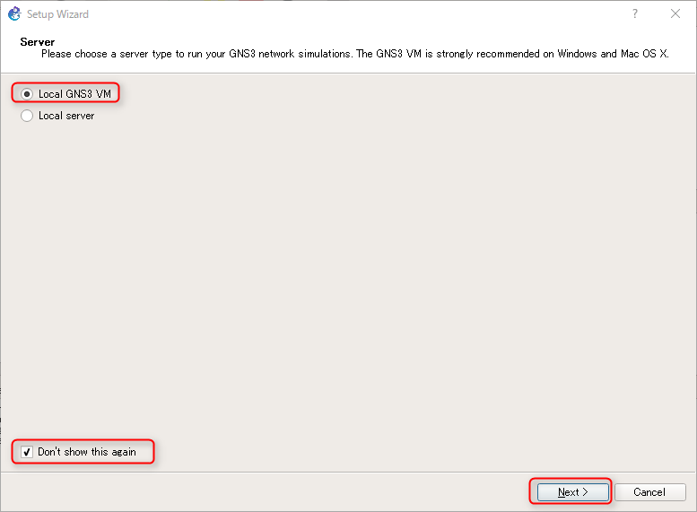

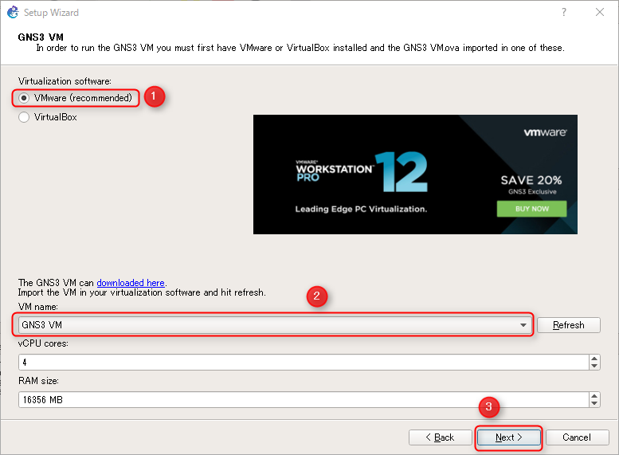

GNS3 VM を起動しているときに出るダイアログ。

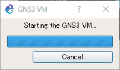

実際の VM の画面表示。

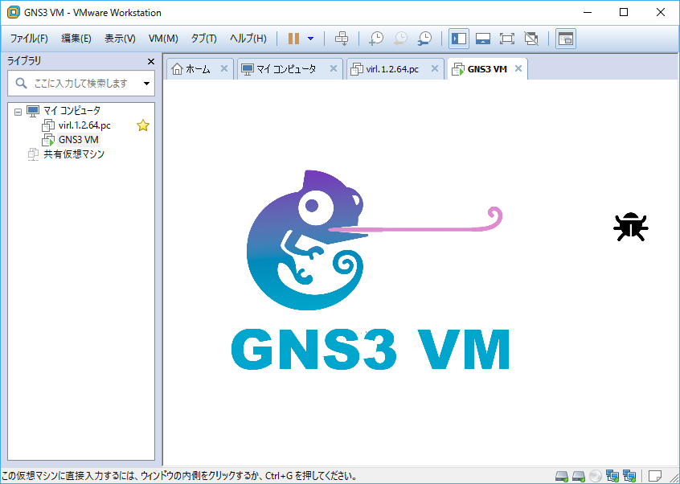

そして起動した結果。

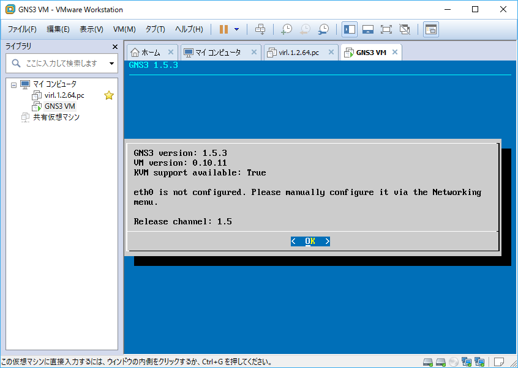

図の状態では IP アドレスが付与されていない。
**おそらくホストオンリーネットワークアダプタの IP アドレスが DHCP で付与されていないのが原因。**
先に VIRL のインストールしちゃったからなのかな。
公式のドキュメントにも同設定しろとか全然書いてないので意味が不明。
このままでは使えない。
ほんと、なんなんだろーね。
こういう一番つまずきやすい部分が導入障壁を上げてる気がするんだけどなあ。
一回シャットダウンさせる。

仮想ネットワークエディタを開く。

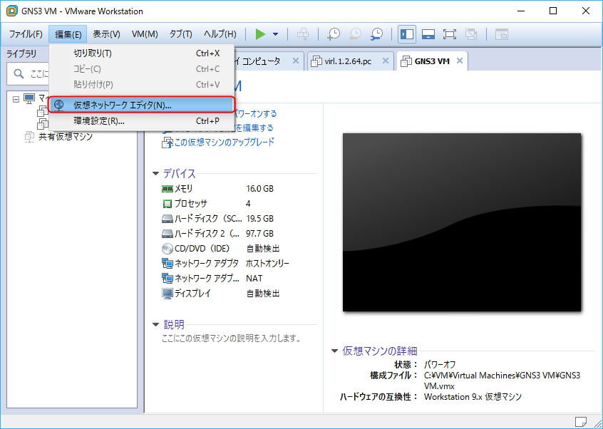

管理者モードに移行する。

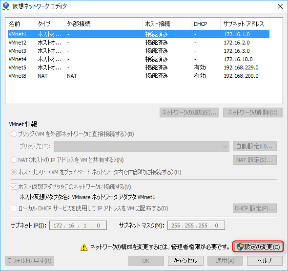

ホストオンリーネットワークアダプタを作成する。
設定は以下のような感じで。

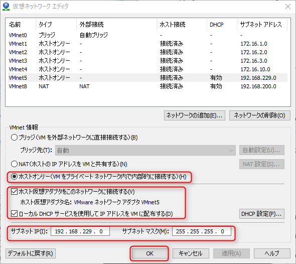

次に GNS3 VM のネットワークアダプタの設定を変更する。
最初は「ホストオンリーネットワーク」、「NAT」になっていると思う。

before

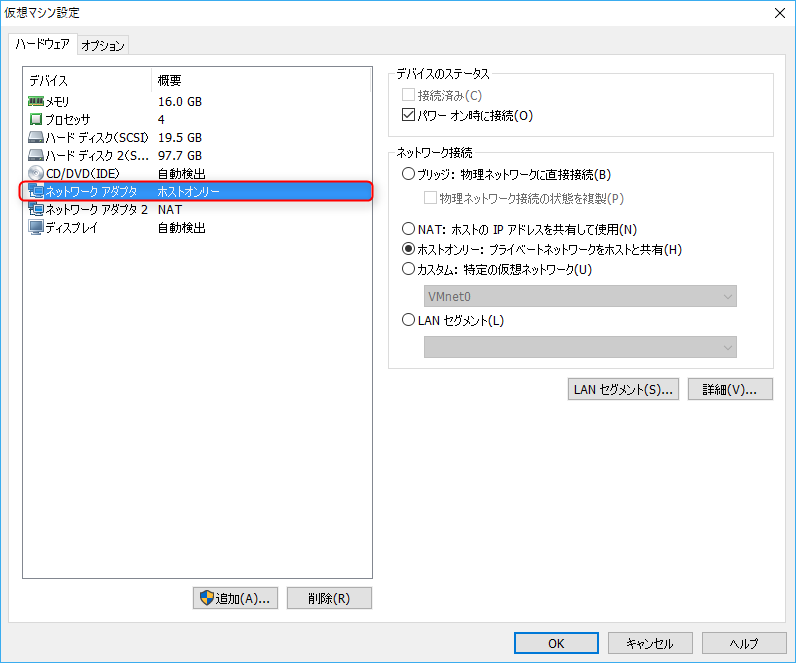

after

ホストオンリーネットワークをさっき作成したものに明示的に置き換える。

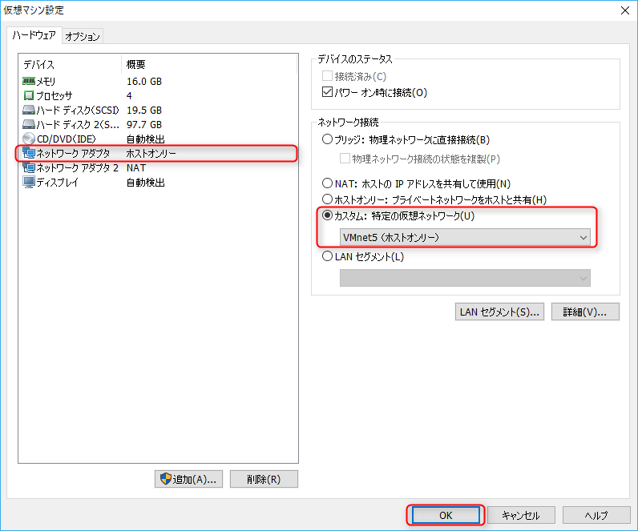

VM 起動。
以下のような感じになれば OK 。

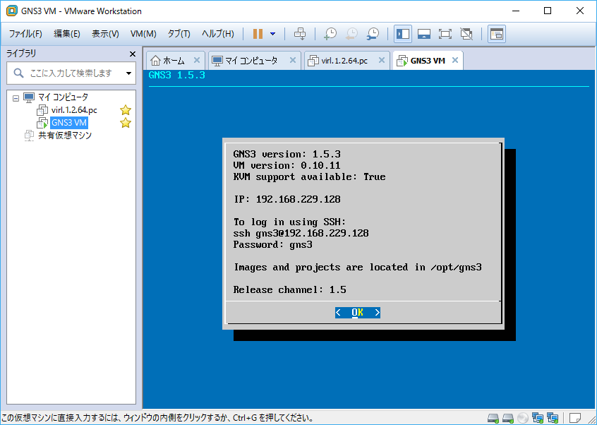

一応 Nested VM の機能が有効化されていることを確認しておこう。
仮想マシンの中で仮想マシンを動かすってことですよ。

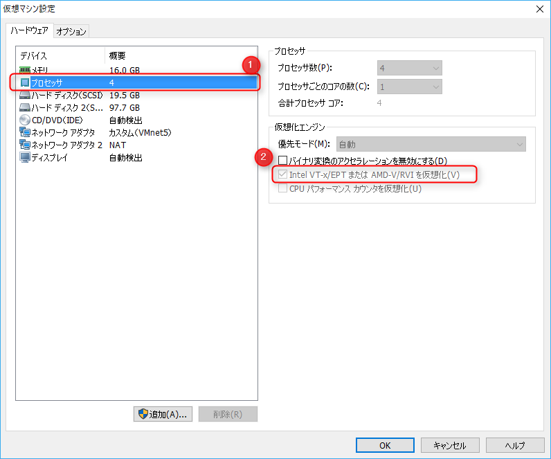

====================================================
Dynamips の IOS 設定をする
====================================================

GNS3 のウィザードに戻る。

いろいろオプションあるがデフォルトでチェック入っているのだけやっとけばいい。
迷わず行けよ！行けばわかるさ！

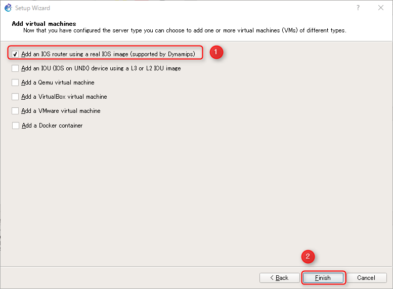

GNS3 VM の中で IOS イメージを動かすように選択する。

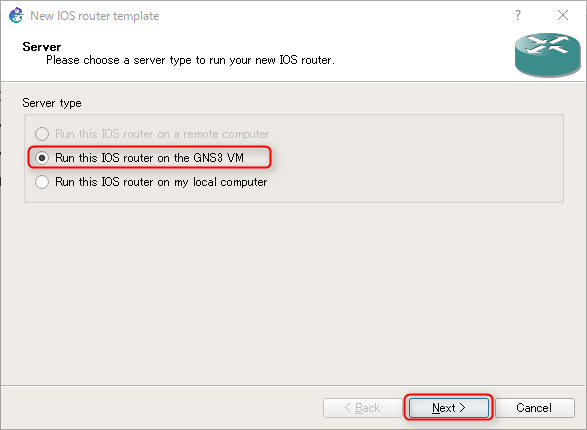

次に IOS イメージのアップロードに入る。

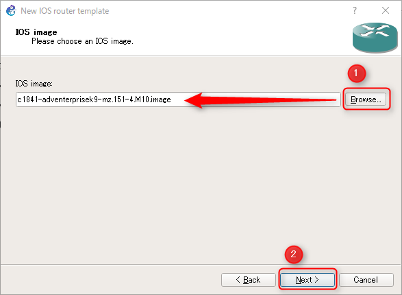

ファイル選択したら解凍しておきますか？って聞かれるので、そのぶんのオーバーヘッドは正直いらないので普通に Yes で解凍しておく。

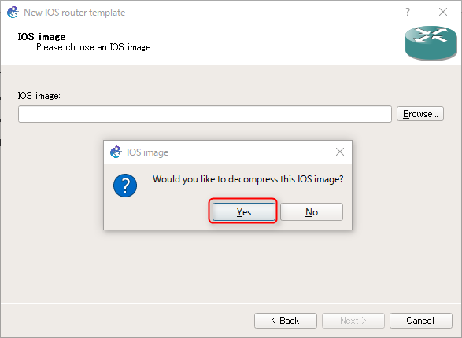

``.image`` という拡張子で解凍される。
**どこに解凍したイメージが置かれたのかとんと検討がつかぬ。**
一瞬 Uploading とかダイアログ出たから GNS3 VM の中に入ったのかな。。。

さて、

**実機の IOS ならなんでも突っ込めばいいとか思うだろ普通？
なんかサポートしてないイメージがあるんだな、これが。。。。**

| This IOS image is for the * platform/chassis and is not supported by this application!

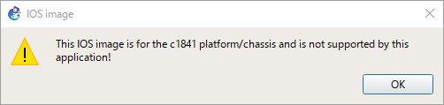

なんか公式のドキュメントの例では ``c3725-adventerprisek9-mz.124-15.T14.bin`` が選択されている。

使える IOS は以下に記載されているようだ。
ちゃんと md5 ハッシュ値も記載されている。

#. `Cisco IOS images for Dynamips - GNS3 <http://docs.gns3.com/1-kBrTplBltp9P3P-AigoMzlDO-ISyL1h3bYpOl5Q8mQ/>`_

メモ

#. ``c3725-adventerprisek9-mz.124-15.T14.bin``

適合する IOS ならプラットフォームと名前は自動で入力される。
そのまま次へ。

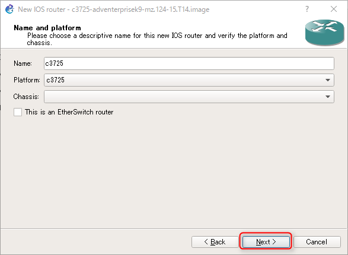

この IOS の場合上記リンクを参照すると推奨メモリと idle-PC value は以下の通りとされている。

* Minimum RAM: 256MB
* Proposed idle-PC value: ``0x60c09aa0``

ダイアログ中のリンクから飛んでも Cisco の推奨スペック検索ページに飛べるのでそれでもいいかもね。

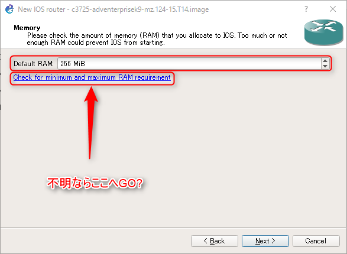

スロットに搭載するモジュール（イーサネットやらシリアルやら）を選択する画面。
略称がなんだかよくわからないが

| In this example both Ethernet and Serial interfaces have been added to the router.

と書いてあるので、この例は

デフォルトの FastEthernet(100Mbps) のインターフェイスに加えて FastEthernet(100Mbps) とシリアルインターフェイスを搭載する設定とのことである。

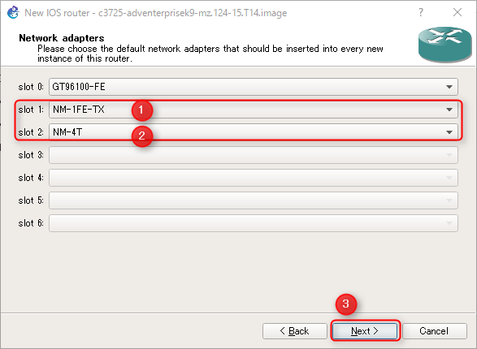

次、前のダイアログで ``NM-4T`` が選択されていた場合は WIC（WAN インターフェイス カード） モジュールが追加可能になっているので選択する。
とりあえずなんだかよくわからんので例のとおりに設定してみる。
ググったら画像がわんさか出てくるからわかりやすくていい。

#. `WIC-1T - Google 検索 <https://www.google.co.jp/search?q=WIC-1T&client=ubuntu&hs=Fp0&channel=fs&hl=ja&biw=1920&bih=941&source=lnms&tbm=isch&sa=X&ved=0ahUKEwjVytWrv6vSAhXKT7wKHcayAPIQ_AUIBigB>`_
#. `WIC-2T - Google 検索 <https://www.google.co.jp/search?q=WIC-1T&client=ubuntu&hs=Fp0&channel=fs&hl=ja&biw=1920&bih=941&source=lnms&tbm=isch&sa=X&ved=0ahUKEwjVytWrv6vSAhXKT7wKHcayAPIQ_AUIBigB#channel=fs&hl=ja&tbm=isch&q=WIC-2T&*>`_

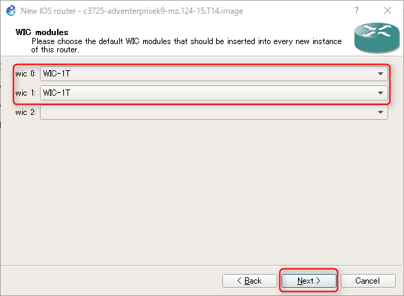

Proposed idle-PC value の設定。
これ設定しないとプロセッサの CPU 使用率が 100% に張り付くらしい。
なんやそれ。。

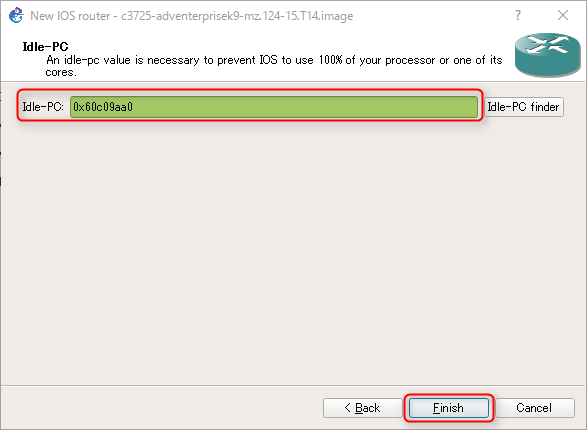

そして設定が終わると Preferences ウィンドウが表示される。
先程設定したルーターのテンプレートが表示される。
次からこれをトポロジに追加したらこの搭載モジュール構成で起動される。
らしい。

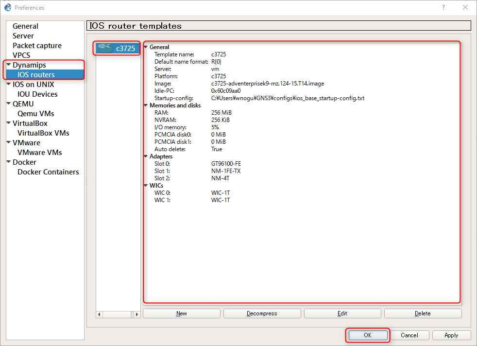

ちなみにこの IOS イメージは GNS3 VM 上で Dynamips というエミュレーションプログラムで動作させられる、らしい？

最初のプロジェクトを入力させる画面に遷移する。

今回は今 CCNP の勉強をしているマルチエリア OSPF の設定をやってみたいので、こんな感じの名前で。

* Name: ``multi-area-ospf-1``
* Location: ``C:\Users\wnogu\GNS3\projects\multi-area-ospf-1``

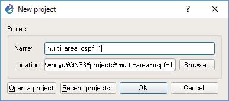

そしてやっと GNS3 の Workspace が拝める。
いや、長かった。。。
初めて経験するプラットフォームのプログラム書いたときぐらい長かった。。。

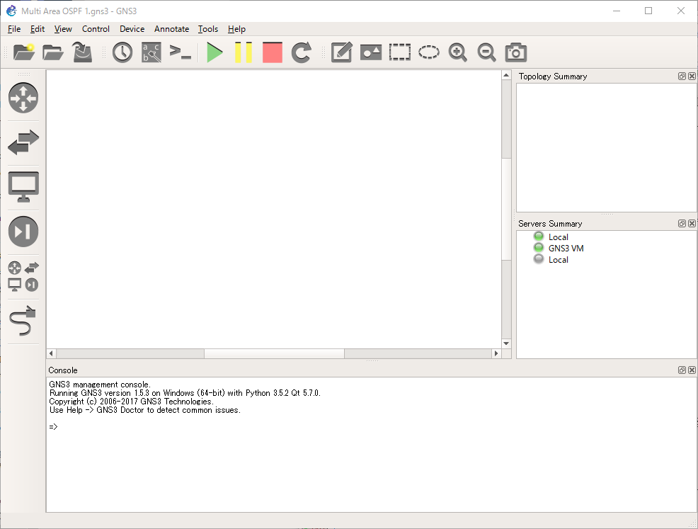

==========================================================
初めての GNS3 トポロジー
==========================================================

#. `Your first GNS3 topology - GNS3 <https://docs.gns3.com/1wr2j2jEfX6ihyzpXzC23wQ8ymHzID4K3Hn99-qqshfg/index.html>`_

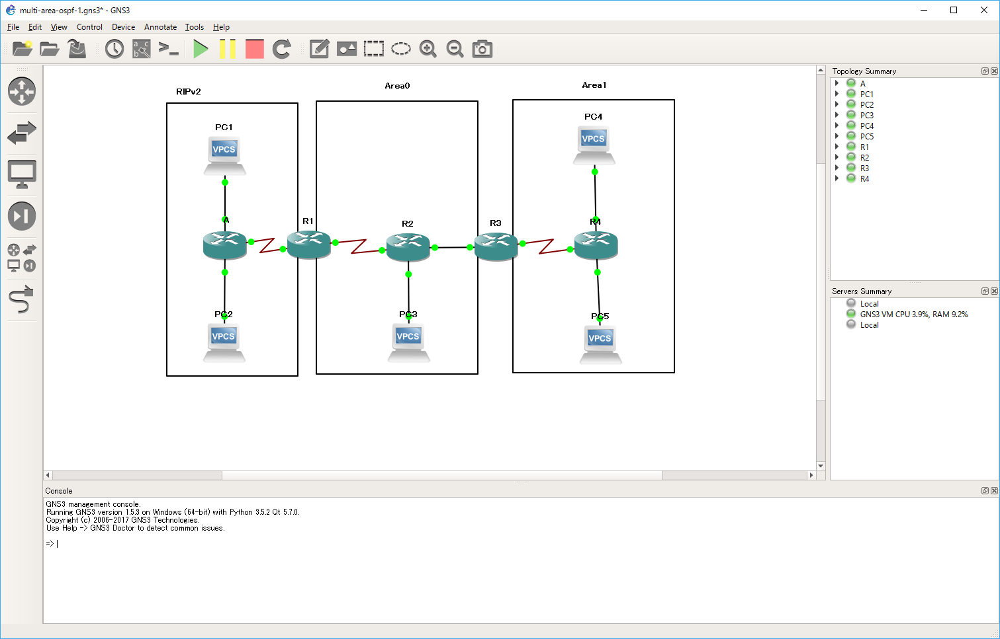

基本的なコンフィグ
---------------------------------------

A::

   en
   conf t
   int fa0/0
   ip addr 172.16.1.10 255.255.255.0
   no shut
   int fa0/1
   ip addr 172.16.2.10 255.255.255.0
   no shut
   int s0/0
   ip addr 172.16.0.10 255.255.255.0
   no shut
   int fa2
   switchport mode access
   switchport access vlan 1
   no shut
   end

R1::

   en
   conf t
   int s2/1
   ip addr 172.16.0.1 255.255.255.0
   no shut
   int fa0/0
   ip addr 10.0.12.1 255.255.255.0
   no shut
   end

R2::

   en
   conf t
   int s0/0/0
   ip addr 10.0.12.2 255.255.255.0
   no shut
   int fa0/0
   ip addr 10.0.23.2 255.255.255.0
   no shut
   int fa0/1
   ip addr 10.0.1.2 255.255.255.0
   no shut
   end

R3::

   en
   conf t
   int fa0/0
   ip addr 10.0.23.3 255.255.255.0
   no shut
   int fa0/1
   ip addr 10.1.34.3 255.255.255.0
   no shut
   end

R4::

   en
   conf t
   int fa0
   ip addr 10.1.1.4 255.255.255.0
   no shut
   int fa1
   ip addr 10.1.2.4 255.255.255.0
   no shut
   int vlan 1
   ip addr 10.1.34.4 255.255.255.0
   no shut
   int fa2
   switchport mode access
   switchport access vlan 1
   no shut
   end

ルーティングプロトコルの設定
----------------------------------------------------

A::

   conf t
   router rip
   version 2
   network 172.16.0.0
   no auto-summary
   end

R1::

   conf t
   router ospf 1
   router-id 1.1.1.1
   ! RIP ルートを OSPF へ再配布
   redistribute rip subnets
   network 10.0.0.0 0.255.255.255 area 0
   exit
   !
   router rip
   version 2
   ! OSPF ルートを RIP へ再配布
   redistribute ospf 1 metric 5
   network 172.16.0.0
   no auto-summary
   exit
   end

R2::

   conf t
   router ospf 1
   router-id 2.2.2.2
   network 10.0.0.0 0.255.255.255 area 0
   end

R3::

   conf t
   router ospf 1
   router-id 3.3.3.3
   network 10.0.23.0 0.0.0.255 area 0
   network 10.1.34.0 0.0.0.255 area 1
   end

R4::

   conf t
   router ospf 1
   router-id 4.4.4.4
   network 10.0.0.0 0.255.255.255 area 1
   end
